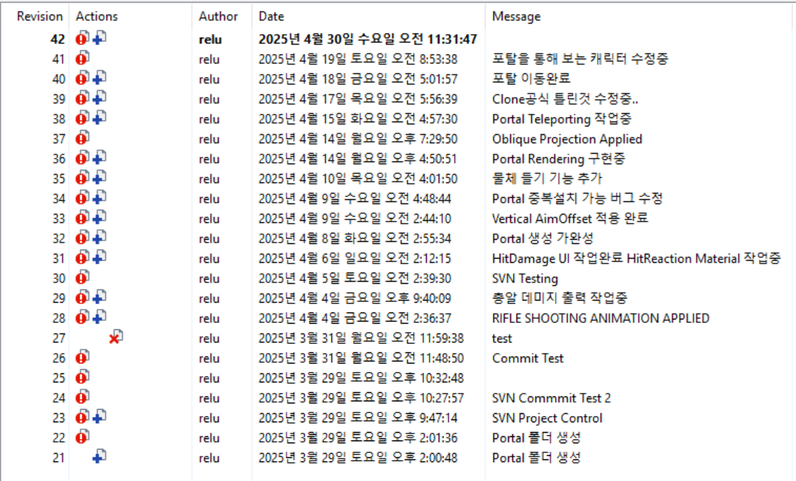

# Portal2

## 저장소 안내

본 프로젝트는 개발 당시 Git이 아닌 SVN(Subversion)을 사용하여 형상관리를 진행하였습니다.
현재 GitHub 저장소는 포트폴리오 공개를 목적으로 기존 SVN 프로젝트를 이전한 저장소입니다.
따라서 실제 개발 과정에서 생성된 SVN 커밋 이력은 GitHub로 이전되지 않았으며, GitHub 저장소에는 소수의 커밋만 존재합니다.
프로젝트의 실제 개발 이력을 확인할 수 있도록 당시 SVN 로그 일부를 아래에 첨부하였습니다.

---

## SVN 개발 로그

---